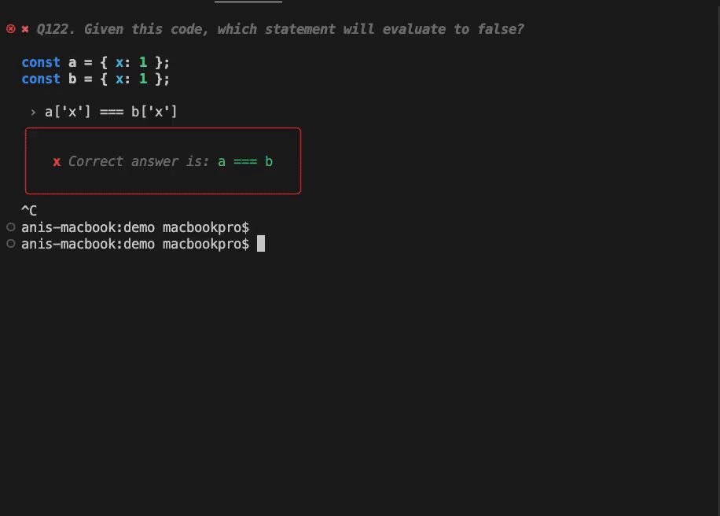

# Linkedin Quizzes

[](https://github.com/nooqta/kodyfire#install-a-kody)
[](https://github.com/nooqta/kodyfire/blob/main/LICENSE)

> Generate linkedin quizzes and related artifacts using [Kodyfire](https://github.com/nooqta/kodyfire).


### 🏠 [Homepage](https://github.com/nooqta/kodyfire)

## Requirements

linkedin-quizzes-kodyfire requires the [kodyfire-cli](https://github.com/nooqta/kodyfire) to be installed

```sh
npm install -g kodyfire-cli
```
## Install

```sh
npm install linkedin-quizzes-kodyfire
```

## Usage

### Method 1: As a generator
In order to generate your artifacts, run the `generate` command. The syntax is `kody generate|g [kody] [concept]`. If you ommit `kody` and `concept` the assistant will prompt you to select them. As an example, run the following command from your terminal:
```sh
kody generate linkedin-quizzes
```
### Method 2: As a runner in a kody project
Refer to the kodyfire __[generate your artifact](https://github.com/nooqta/kodyfire#generate-your-artifact)__ section.
Once your project is initialized and ready for kody,
generate your linkedin-quizzes concept using the `kody ride` command or manually. As an example, A declaration for a linkedin-quizzes concept might look like the following: 
```json
{
	"name": "javascript",
	"showAnswer": true,
	"showCorrectAnswer": true,
	"showReference": true,
	"showScore": true
}
```

After adding your concept(s) definitions, run the following command to generate your assets.

```sh
kody run -s kody-linkedin-quizzes.json
```
### Available concepts 

#### `component` (default)
> Generates a linkedin Quiz

##### Params

- `name` _enum_ - The test name you want to practice
- `showAnswer` _boolean_ - If the result of the answer should be displayed (Correct|Incorrect).
- `showCorrectAnswer` _boolean_ - If the correct should be displayed when the provided answer is wrong.
- `showReference` _boolean_ - Show reference links if any.
- `showScore` _boolean_ - Show the score by the end of the test.

#### `mixmatch` 
> Generates a mixed practice test from many Linkedin quizzes

##### Usage
```bash
kody g linkedin-quizzes mixmatch
```
##### Params

- `quizzes` _quiz[]_ - The quizzes you want to use for your quiz
- `showAnswer` _boolean_ - If the result of the answer should be displayed (Correct|Incorrect).
- `showCorrectAnswer` _boolean_ - If the correct should be displayed when the provided answer is wrong.
- `showReference` _boolean_ - Show reference links if any.
- `showScore` _boolean_ - Show the score by the end of the test.

##### Quiz
- `name` _enum_ - The test name you want to practice
- `total` _number_ - Total number of questions
- 
## 📅 Future Features
- ~~Mix questions from multiple practice tests~~
- Track progress
- Display overtime progress in a chart (cli)
- Share result on social media
- Display global ranking for kody 'official' practice tests
- Add custom practice tests by url

## Author

👤 **Anis Marrouchi**

* Website: https://noqta.tn
* Twitter: [@anis\_marrouchi](https://twitter.com/anis\_marrouchi)
* GitHub: [@anis-marrouchi](https://github.com/anis-marrouchi)
* LinkedIn: [@marrouchi](https://linkedin.com/in/marrouchi)

## 🤝 Contributing

Contributions, issues and feature requests are welcome!

Feel free to check [issues page](https://github.com/nooqta/linkedin-quizzes-kodyfire/issues). 

## Show your support

Give a ⭐️ if this project helped you!

## Credits

- [linkedin-skill-assessments-quizzes](https://github.com/Ebazhanov/linkedin-skill-assessments-quizzes) by [Ebazhanov](https://github.com/Ebazhanov). and contributors(There are many). Big thanks to all of them
- [kodyfire](https://github.com/nooqta/kodyfire) by [nooqta](https://github.com/nooqta) The kodyfire generator.

## 📝 License

Copyright © 2022 [Anis Marrouchi](https://github.com/anis-marrouchi).

This project is [MIT](https://github.com/nooqta/kodyfire/blob/main/LICENSE) licensed.

***
_This README was generated with ❤️ by [readme-kodyfire](https://github.com/nooqta/readme-kodyfire)_
